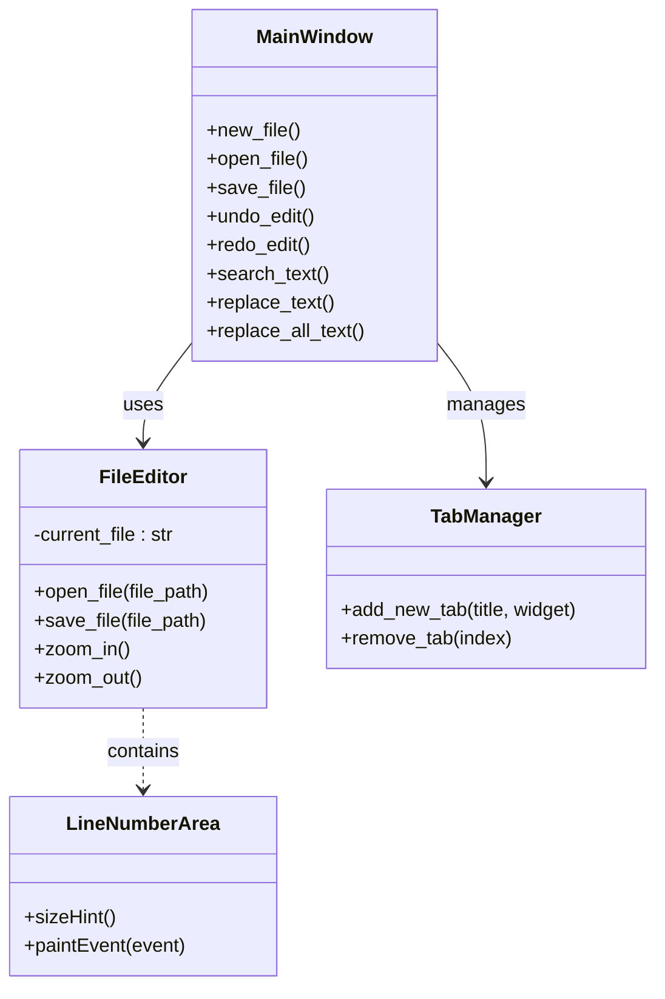

# マイエディタ

## 概要
このプロジェクトは、PySide6を用いたシンプルなテキストエディタです。  
ファイルの編集、検索・置換、タブ管理などの基本機能を備えています。

## システム要件
- Python 3.8以上

## パッケージ情報
- PySide6: GUI構築用ライブラリ
- pytest: テスト実行用ライブラリ
- その他依存パッケージは requirements.txt をご参照ください

## アプリの機能
- ファイルの新規作成、編集、保存
- 検索・置換（正規表現とリテラル両対応）
- タブ管理による複数ファイルの同時操作
- フォルダの読み込みとファイルツリー表示
- テキストの拡大・縮小（Ctrl+ホイール操作）

## インストール
1. 必要な依存パッケージをインストールします:
   ```
   pip install -r requirements.txt
   ```
2. プロジェクトディレクトリに移動します:
   ```
   cd /c:/Users/grove/OneDrive/Desktop/開発/my_editor
   ```

## 使い方
- エディタの起動:
  ```
  python main_window.py
  ```
- メニューやショートカット (Ctrl+S, Ctrl+F など) により操作が可能です。

## テストの実行
テストは [pytest](https://docs.pytest.org/) を用いて実行します:
```
pytest
```

## クラス図

